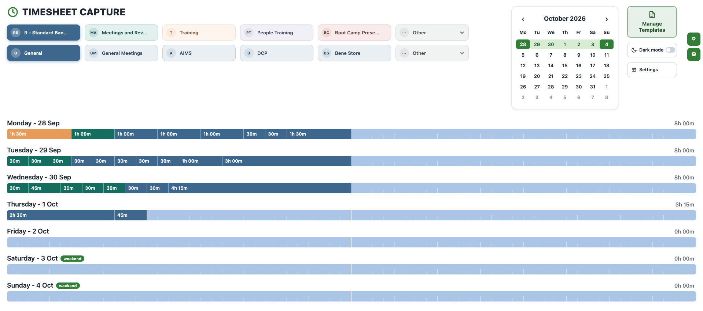
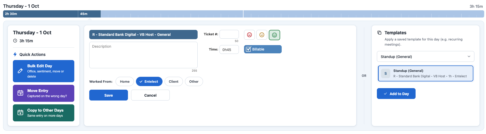
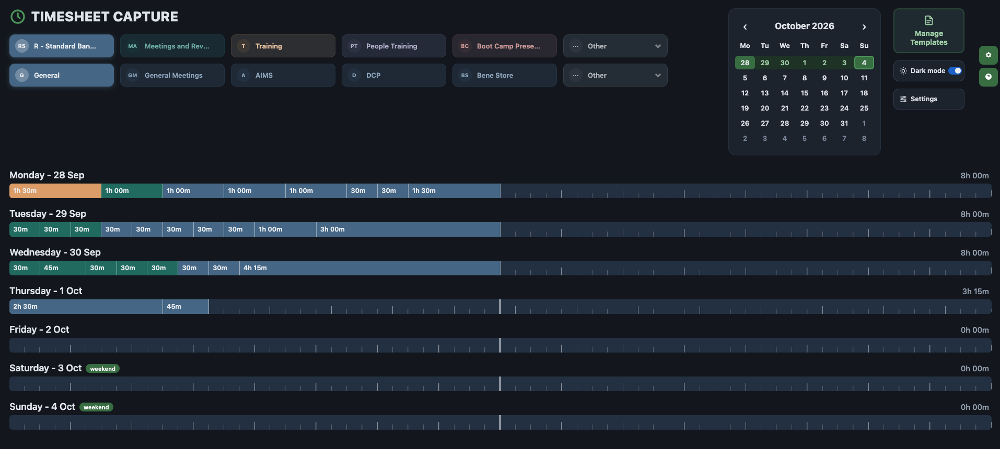
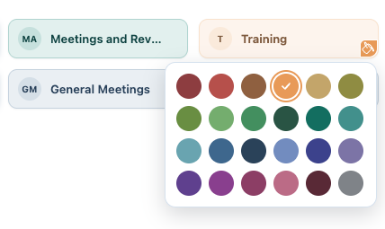
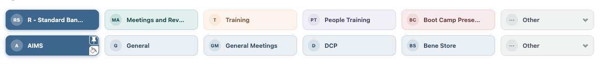
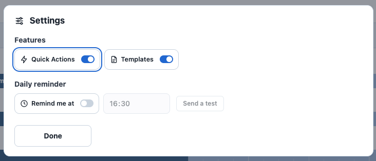

# Timesheet Booster

**Capture your timesheet in seconds, not minutes.**

Timesheet Booster is a Chrome extension for the [Entelect timesheet](https://employee.entelect.co.za/Timesheet). It gives the page a clean new look, a dark mode and your own colours. It also adds shortcuts for the jobs that usually take dozens of clicks: recurring meetings, entries on the wrong day, and setting your office for a whole day.

Everything runs on top of the existing timesheet. Your entries are still saved by the timesheet itself, so nothing about how your time is submitted or signed off changes.



## Features

### A cleaner, modern timesheet

The timesheet gets a fresh layout: a clear title, project and category chips with initials, a tidy calendar, and day timelines with quarter-hour ticks that make gaps easy to spot. The entry form is restyled as a card, with simple outline sentiment faces and "Worked From" pills.



### Dark mode

Switch the timesheet to dark mode from the header. Your choice is remembered, applied before the page loads (no white flash) and kept in step across all your open timesheet tabs.



### Your own colours

Hover a project or category and click the fill button to pick a colour from a palette built to match the timesheet's own. Categories can follow their project's colour or have their own. Captured time on the day timelines uses the same colours, so you can see at a glance where your week went.



### Pinned categories

Pin the categories you use most and they stay at the front of the list, so you never have to dig through "Other" again. Pins and colours sync through your Chrome profile.



### Quick Actions

Open any day and a **Quick Actions** panel appears next to the entry form:

- **Bulk Edit Day:** set the office or sentiment for every entry on a day, move all of a day's entries to another date, or clear the day completely. Signed-off entries are never changed.
- **Move Entry:** captured something on the wrong day? Send it to the right one in one click.
- **Copy to Other Days:** create the same entry on several days at once, with a "Weekdays" shortcut for things like daily standups.


### Templates for recurring entries

Tick **Save as template** when you add an entry, then reuse it on any day straight from the Templates card next to the entry form. Your standup, client sync or team meeting is a single click every week. Rename or delete templates from **Manage Templates** in the header.


### Default office

Choose your usual office under **Settings** in the header and it is preselected under "Worked From" on every new entry.



### Hover preview

With a category selected, hovering over a day's timeline highlights the time up to your cursor, so you can see exactly how much time you are about to capture.

## Installing on Chromium browsers

Timesheet Booster isn't on the Chrome Web Store yet, so you install it from source. This works in any Chromium browser: Chrome, Edge, Brave, Arc, Opera and Vivaldi.

1. Get the code, either by cloning the repository:
   ```sh
   git clone https://github.com/DuartBreedt/timesheet-booster-chrome-extension.git
   ```
   or by downloading it as a ZIP from GitHub (**Code > Download ZIP**) and unzipping it somewhere permanent.
2. Open your browser's extensions page:

   | Browser | Address |
   | --- | --- |
   | Chrome, Arc | `chrome://extensions` |
   | Edge | `edge://extensions` |
   | Brave | `brave://extensions` |
   | Opera | `opera://extensions` |
   | Vivaldi | `vivaldi://extensions` |

3. Turn on **Developer mode** (a toggle in the top right, or in the left sidebar on Edge).
4. Click **Load unpacked** and select the project folder (the one containing `manifest.json`).
5. Open the [timesheet](https://employee.entelect.co.za/Timesheet) and enjoy.

**Updating:** pull the latest changes (or download the ZIP again into the same folder), then click the reload icon on the Timesheet Booster card in your extensions page and refresh the timesheet.

> Don't delete or move the folder after installing. The browser loads the extension from it every time.

## Contributing

Contributions are very welcome, whether it's a bug fix, a new quick action or a styling tweak. Ideas that are already on the table live in [TODO.md](TODO.md).

### Getting set up

1. Fork the repository and clone your fork.
2. Load it as an unpacked extension (see [Installing](#installing-on-chromium-browsers)).
3. Make your changes, click reload on the extension card, then refresh the timesheet to see them.

There is no build step: the extension is plain JavaScript and CSS, loaded straight from the folder.

### How it fits together

| Path | What lives there |
| --- | --- |
| `manifest.json` | Extension config (Manifest V3) |
| `service-workers/background.js` | Injects the content scripts whenever a timesheet tab loads or navigates |
| `content-scripts/redesign.css`, `violations.css` | The redesign, dark mode and chip styles, loaded before the page paints |
| `content-scripts/theme.js` | Applies dark mode early and keeps tabs in sync |
| `content-scripts/*-render.js` | The UI: chips, colours, pinning, timelines, Quick Actions, templates and settings |
| `content-scripts/*-bridge.js` | Run in the page's own context to drive the timesheet's widgets and read entry details |
| `constants.js` | Shared selectors and storage keys |

Most features run in the extension's isolated world. Anything that needs the timesheet's own jQuery or widgets goes through a bridge script that runs in the page, and the two talk via `tb:*` DOM events.

### Guidelines

- Follow the code style in [CLAUDE.md](CLAUDE.md): comments explain *why*, not *what*, and stay short.
- Keep the timesheet as the source of truth. Create, edit and delete entries through the timesheet's own forms and endpoints, never around them.
- Test in both light and dark mode, and against entries that are signed off.
- Keep pull requests focused on one change, and include a screenshot or GIF for anything visual.

### Submitting a change

1. Create a branch: `git checkout -b my-improvement`
2. Commit your changes with a clear message.
3. Push to your fork and open a pull request against `main`, describing what changed and how you tested it.

Found a bug or have an idea but no time to build it? [Open an issue](https://github.com/DuartBreedt/timesheet-booster-chrome-extension/issues).
